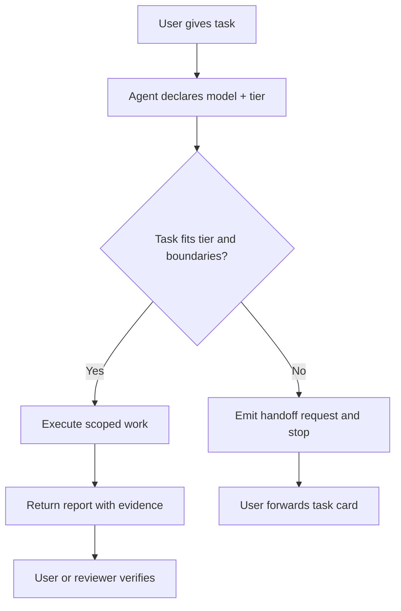

# vibe-agent

> Minimal coordination rules for running multiple AI coding agents without
> losing ownership, context, or proof of completion.
>
> 面向多 AI 编码 Agent 协作的极简规则集：让 Codex、Claude Code、Gemini、
> MiMo、DeepSeek 在同一个项目里知道自己该不该做、何时停、如何交接、怎样证明完成。


## What It Solves

When several agents work on the same project, coordination usually fails in
predictable ways:

| Failure mode | What happens |
|---|---|
| Vague completion | An agent says "done" without evidence that the goal was met. |
| Lost handoff | The next agent lacks the task boundary, files, or current state. |
| Capability drift | A weaker agent wanders into architecture or cross-module decisions. |
| Context break | Each transfer forces the user to explain the project again. |

vibe-agent gives every agent the same small operating contract:

1. Declare identity and capability tier.
2. Decide whether the task fits that tier.
3. Stop and emit a handoff request when it does not.
4. Report completion with evidence, not vibes.

## How It Works



The core rule is deliberately manual: handoffs are copy-pasted by a human.
That keeps the system small, inspectable, and hard to over-automate before real
validation proves automation is worth adding.

## What Ships In v0.1

| Path | Purpose |
|---|---|
| `plugin/vibe-agent/skills/core-coordination/SKILL.md` | The actual rule set: tiers, stop conditions, task cards, handoff format, report format, red lines. |
| `skills/core-coordination/SKILL.md` | Root-level copy for `npx skills add` compatibility. |
| `plugin/vibe-agent/presets/my-setup.example.yaml` | Example model and quota configuration. |
| `docs/loading-paths.md` | Verified loading paths for Claude Code, Codex, and Gemini CLI. |
| `docs/operating-model-draft.md` | Historical 1586-line draft, kept as reference and explicitly not the current spec. |

## Current Status

This is a **pre-validation v0.1 draft**.

- Built: one core coordination skill.
- Verified: basic loading paths for Claude Code, Codex, and Gemini CLI.
- Not built: automation, routing engine, review engine, standalone landing page.
- Not validated yet: repeated real-world multi-agent handoffs in production work.

The project stays small on purpose. New skills are added only after real use
shows the current rule set is insufficient.

## Install

### Local validation install

Use this while the project is still pre-validation, so you test the exact
working tree:

```bash
git clone https://github.com/kelipovanatalja453-bot/vibe-agent.git
cd vibe-agent
bash install.sh --dry-run
bash install.sh
```

### GitHub install after release

After the current cleanup is pushed to GitHub:

```bash
npx skills add https://github.com/kelipovanatalja453-bot/vibe-agent
npx skills add https://github.com/kelipovanatalja453-bot/vibe-agent --skill "core-coordination"
```

### Manual install

```bash
# Claude Code
cp -r plugin/vibe-agent/skills/core-coordination ~/.claude/skills/

# Codex
cp -r plugin/vibe-agent/skills/core-coordination ~/.codex/skills/

# Gemini CLI
gemini skills install plugin/vibe-agent/skills/core-coordination
```

Then start an agent and ask:

```text
who are you?
```

It should declare its framework, model, tier, and whether it will take the task.

## The Core Formats

### Task card

```text
# 任务: [一句话, ≤20 字]
## 在哪: 属于 [大目标] / 下一步预告 [...]
## 给谁: [目标 Agent]
## 接收方需要知道: 文件 [...] / 当前状态 [1-2 行]
## 应该做的: 1. ... 2. ...
## 完成 =: 证据 checklist (可粘贴/截图/链接) + 验证命令
## 失败时: 阻塞条件
```

### Completion report

```text
# 回报: [一句话]
## 状态: [完成 / 部分完成 / 阻塞]
## 证据: - [✅] 证据1: [...] - [❌] 证据2: [未完成, 原因]
## 改了什么: 文件 [...] / 命令 [...]
## 需要决策吗?: [不需要 / 需要 + 具体问题]
```

## Validation Criteria

v0.1 is considered useful only if 3-5 real multi-agent handoffs show that:

- A new agent finds the right entry files within 2 minutes.
- The receiver does not need the user to repeat the background.
- Agents do not mistake `docs/operating-model-draft.md` for the current spec.
- Every completion report links to files, commands, screenshots, or other proof.

If one of these fails, revise the matching rule. Do not add a large routing
system until the failure proves that a small rule cannot solve it.

## Roadmap

| Version | Plan |
|---|---|
| v0.1 | One core skill, manual handoff, evidence-bound reports. |
| v0.2 | Add only the skills proven necessary by validation. |
| v0.5 | Refine after repeated use on real multi-agent projects. |

## Contributing

Issues and PRs are welcome, but this repository is still pre-validation. Open
an issue before large contributions, especially anything that expands the core
rule set or adds automation.

## License

MIT © 2026 Zhou Hongyuan
