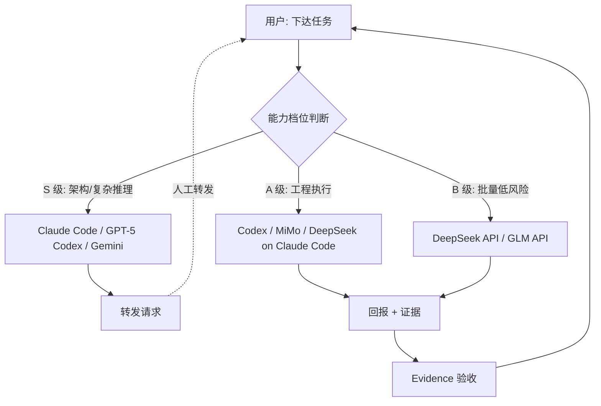

# vibe-agent

> A minimal methodology framework for multi-LLM-agent coding workflows.
> 一个面向多 LLM Agent 协作的极简方法论框架。


## Why this exists

When you use multiple AI coding agents at once — Codex, Claude Code, MiMo,
DeepSeek, Gemini — coordination breaks down in predictable ways:
agents claim "done" without proving the goal was met, tasks get lost between
handoffs, low-capability agents wander into architecture decisions, and context
drops every time work passes from one agent to another.

vibe-agent is a small set of shared rules that every agent loads, so they all
speak the same language: capability tiers, stop conditions, a uniform task card,
handoff requests, and evidence-bound completion.

当你同时使用多个 AI 编码 Agent 时，协作会以可预测的方式崩坏：Agent 声称"完成"
却没证明目标达成、任务在交接间丢失、低能力模型越界改架构、上下文每次转手都断层。
vibe-agent 是一套所有 Agent 共享的极简规则，让它们说同一种语言。

## How it works



Core loop: declare identity → judge if task fits your tier → if not, emit a
handoff request and stop → if yes, execute → report back with evidence →
human verifies against the original goal.

## What's included (v0.1)

- `plugin/vibe-agent/skills/core-coordination/SKILL.md` — the one skill that
  matters: identity declaration, capability tiers, stop conditions, handoff
  request format, task card format, report format, red lines.
- `plugin/vibe-agent/presets/my-setup.example.yaml` — example resource config.
  Copy it, fill in your own models and quotas.
- `docs/operating-model-draft.md` — a 1586-line early design document, kept as
  a reference. **Pre-validation; expect heavy revision.**

## What's NOT here yet (honest status)

- Additional skills (handoff, review-verify, quota-routing, multi-agent-parallel)
  are planned but **not built**. They will be added only when real use proves
  they're needed.
- No automation. Handoffs are copy-pasted by a human on purpose.
- No real-world validation case study yet (planned: Jun–Jul 2026).
- No standalone landing page.

## How to use

1. Copy the skill into your agent's skill directory:
   ```bash
   git clone https://github.com/{{GITHUB_USERNAME}}/vibe-agent.git
   cp -r vibe-agent/plugin/vibe-agent/skills/core-coordination ~/.codex/skills/
   cp -r vibe-agent/plugin/vibe-agent/skills/core-coordination ~/.claude/skills/
   ```
   (Gemini's skill mechanism differs — see notes in SKILL.md.)
2. Copy `my-setup.example.yaml` to `my-setup.yaml` and fill in your own models.
3. Start any agent and ask "who are you?" — it should declare its tier.

## Roadmap

- **v0.1 (now)**: one core skill, one example preset, README visualization.
- **v0.2**: add skills proven necessary by real use; add more presets.
- **v0.5**: refined after validation on real multi-agent projects.

The guiding principle: rules emerge from real use, not upfront design. This
project deliberately stays small until usage proves what to add.

## Contributing

Issues and PRs welcome, but note this is **pre-validation** and may change
significantly. Open an issue before large contributions.

## License

MIT © 2026 {{YOUR_NAME}}
